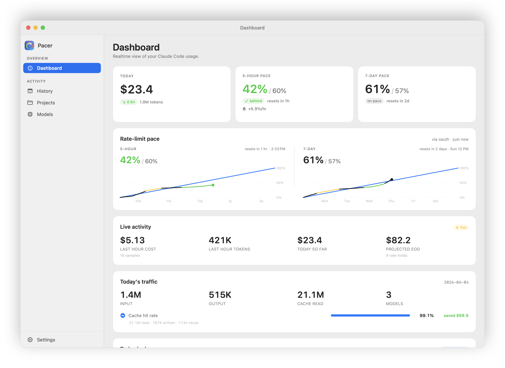
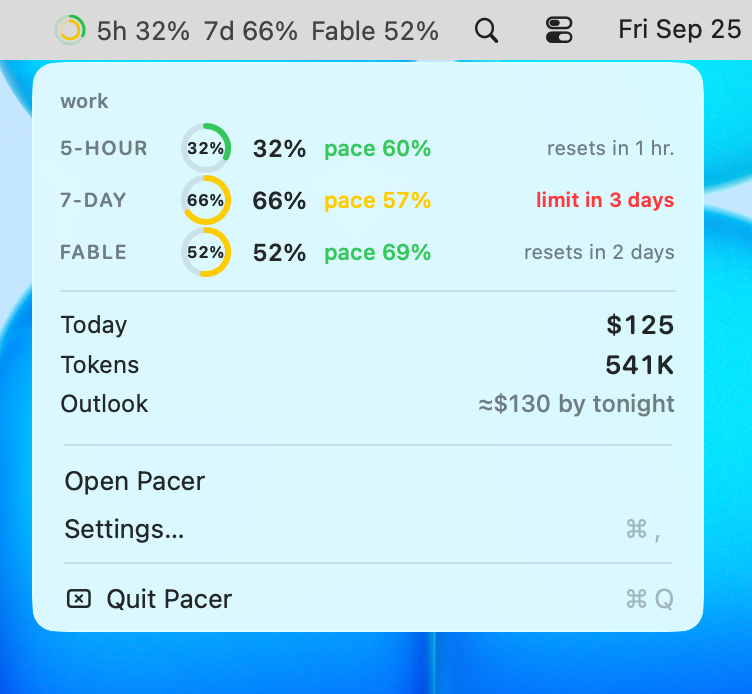
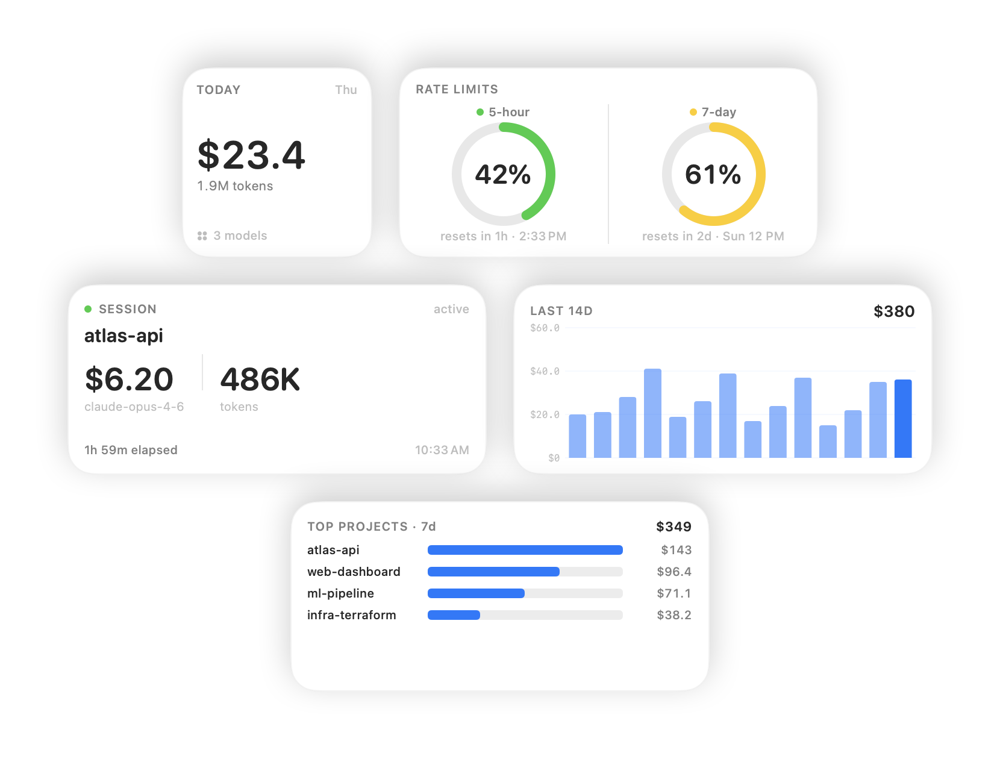
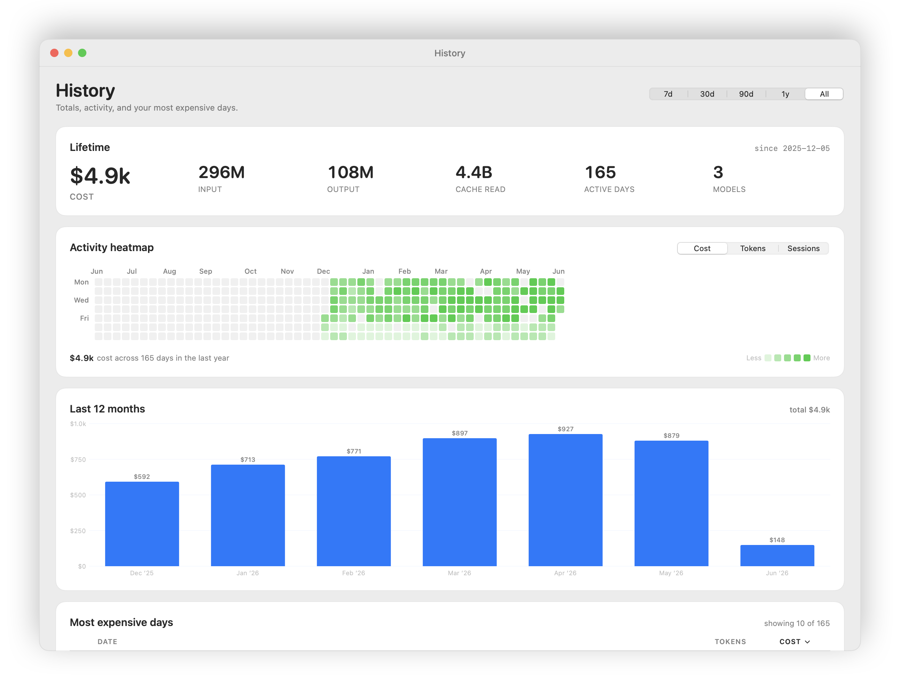
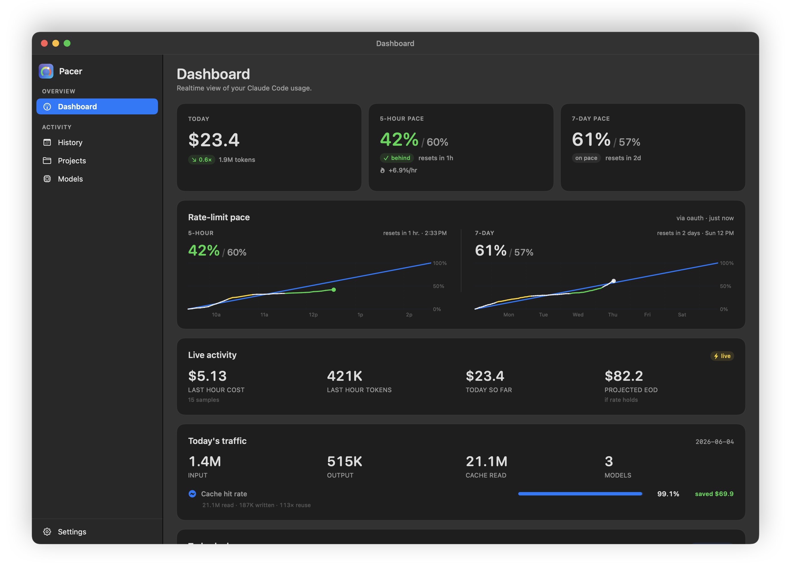

# Pacer

[](https://github.com/EricAndrechek/Pacer/actions/workflows/ci.yml)
[](LICENSE)
[](https://www.apple.com/macos/)
[](https://github.com/EricAndrechek/Pacer/releases/latest)

**Know what Claude Code is costing you — and how close you are to your limits — right from your Mac's menu bar.**

Pacer is a free, open-source macOS app that keeps an eye on your Claude Code
usage: the tokens you're burning, what they cost, how close you are to your
5-hour and weekly rate limits, and where the spend is going — by project, by
model, by day. It sits quietly in your menu bar, keeps itself up to date, and
keeps all of your data on your own Mac.

<p align="center">
  
</p>

<table align="center">
  <tr>
    <td align="center" valign="middle">
      
      <br><sub><b>Menu-bar readout</b></sub>
    </td>
    <td align="center" valign="middle">
      
      <br><sub><b>Click-down popover</b></sub>
    </td>
  </tr>
</table>

<p align="center">
  
  <br><sub><b>Home-screen &amp; Notification Center widgets</b></sub>
</p>

<details>
<summary><strong>More screenshots</strong> — six-month history &amp; dark mode</summary>
<br>
<p align="center">
  
  <br><sub><b>History — lifetime totals, six-month heatmap, monthly spend</b></sub>
</p>
<p align="center">
  
  <br><sub><b>Dark mode, throughout</b></sub>
</p>
</details>

> **Heads up — early days.** Pacer is pre-1.0 and under active development. It
> works and it's useful today, but expect the occasional rough edge, and your
> saved history may need to be rebuilt between 0.x versions.

## Download & install

1. **[Download the latest version →](https://github.com/EricAndrechek/Pacer/releases/latest)**
   (grab the `Pacer-x.y.z.dmg` file under "Assets").
2. Open the downloaded file and drag **Pacer** into your **Applications** folder.
3. Launch Pacer. It lives in your **menu bar** — look for the little gauge icon
   up top (there's no Dock icon). Click it to open the dashboard.
4. The first time, macOS asks permission for Pacer to read Claude Code's files.
   Click **Allow** — that's how Pacer sees your usage. Nothing leaves your Mac.

That's all. **Pacer keeps itself up to date automatically:** when a new version
ships, it offers to install it for you — no re-downloading, no reinstalling.

**You'll need** macOS 15 (Sequoia) or newer, on either Apple Silicon or Intel.

## What you get

- **Rate-limit pacing.** Your 5-hour and weekly windows as easy-to-read pace
  charts — are you ahead, on track, or about to hit the wall? Color bands
  (behind / on track / ahead / nearly maxed) tell you at a glance, refreshed
  every few minutes from Anthropic's usage data.
- **Costs, your way.** See spend the way Claude Code reports it, or have Pacer
  price it from tokens itself — switchable in Settings. Daily, monthly, and
  all-time totals included.
- **Where it's going.** Break usage down by project and by model, drill into any
  single day, and see a GitHub-style activity heatmap of the last six months.
- **Live "today" view.** Your current burn rate plus a running "at this pace,
  today will end at about $X" projection.
- **At a glance, always.** A configurable menu-bar readout (icon, percent, or
  both) plus home-screen-style widgets for cost and pacing.
- **Optional nudges.** Local notifications when you cross a rate-limit threshold
  (50 / 75 / 90%) or blow past a daily spending limit you set. Off by default.
- **Export.** Send daily totals, daily-by-model, or per-project numbers to a
  CSV for your own spreadsheets.

## How Pacer compares

You've got options for keeping an eye on Claude Code usage — Claude Code's own
`/usage`, the popular [`ccusage`](https://github.com/ryoppippi/ccusage) CLI, and
several menu-bar apps, the closest being [Claude God](https://claudegod.app) and
[ccseva](https://github.com/Iamshankhadeep/ccseva). They're good tools; here's
the honest lay of the land.

| | **Pacer** | **[Claude God](https://claudegod.app)** | **[ccseva](https://github.com/Iamshankhadeep/ccseva)** | **[ccusage](https://github.com/ryoppippi/ccusage)** | **CC `/usage`** |
|---|:---:|:---:|:---:|:---:|:---:|
| Form factor | Menu-bar app | Menu-bar app | Menu-bar app | CLI | In-terminal |
| Native macOS (not Electron) | ✓ | ✓ | – (Electron) | – | – |
| Always-on, glanceable | ✓ | ✓ | ✓ | – | – |
| Live limit % from Anthropic's API | ✓ | ✓ | ✦ | ✦ | ✓ |
| Pace vs. ideal-burn line | ✓ | – | – | – | – |
| End-of-day spend projection | ✓ | ✓ | ✓ | – | – |
| Activity heatmap (6 months) | ✓ | – | – | – | – |
| Per-project & per-model breakdown | ✓ | ✓ | ✓ | ✓ | – |
| Home-screen / Notification Center widgets | ✓ | ✓ | – | – | – |
| Threshold / budget notifications | ✓ | ✓ | ✓ | – | – |
| CSV export | ✓ | ✓ | – | ✓ | – |
| ROI: cost vs. git commits | – | ✓ | – | – | – |
| Claude Code plugin marketplace | – | ✓ | – | – | – |
| Free & open source | ✓ | ✓ | ✓ | ✓ | – |

<sub>✦ estimates the windows from your local JSONL logs rather than reading
Anthropic's usage API. Best-effort as of June 2026 — these tools all move fast,
so corrections are welcome via an issue or PR.</sub>

**The gist:**

- **vs. `/usage`** — Claude Code's built-in view is a *snapshot you ask for* in
  one terminal; Pacer is the always-on, zoomed-out companion that remembers every
  session. The speedometer in one car vs. the dashboard that logs every trip.
- **vs. `ccusage`** — a great CLI for scriptable numbers (Pacer's tests even
  cross-check their scanner against it); Pacer is the GUI you glance at instead of
  a command you re-run, and it reads your *actual* limit % from Anthropic rather
  than estimating from logs.
- **vs. Claude God / ccseva** — the closest rivals, and genuinely nice. Pacer
  leans into *pacing* (your windows against an ideal-burn line, "will I run out
  before the reset?"), native + quiet-by-default, and signed/notarized
  self-update; Claude God goes further on ROI/git correlation and a plugin
  marketplace, and ccseva on its glassy UI. Pick the one that thinks about your
  usage the way you do — they coexist happily.

## Privacy

Pacer is **local-first**. It reads only the files Claude Code already writes to
your own Mac, and it sends nothing about your usage anywhere:

- `~/.claude/projects/*.jsonl` — your session token usage, read on your machine.
- The Claude Code login token in your macOS Keychain — used only to ask
  Anthropic for your rate-limit status, the same way Claude Code itself does.

The **only** network connections Pacer makes are:

- `api.anthropic.com` — to check your rate-limit windows (~12 small requests an
  hour while it's running).
- `github.com` — to check for app updates (once at launch, then every 24 hours).

**No analytics, no telemetry, no third parties.** Your data stays on your Mac in
`~/Library/Group Containers/…/pacer.sqlite`, and it persists across app updates.

---

## For developers

Pacer is SwiftUI + SwiftData + Charts, signed with Developer ID and notarized,
auto-updating via [Sparkle](https://sparkle-project.org). Contributions welcome —
see [`CONTRIBUTING.md`](CONTRIBUTING.md).

### Components

| Component | Role |
| --- | --- |
| `Pacer.app` | Main UI + menu-bar item. Data collection (FSEvents JSONL scan + OAuth poll) runs in-process inside this binary — there is no separate daemon. |
| `PacerWidgets` | WidgetKit extension — reads the shared App Group store directly. |
| `PacerCore` | Shared Swift package — parsers, models, scan coordinator, recomputers. |

### Building from source

For everyday use, the [released DMG](https://github.com/EricAndrechek/Pacer/releases/latest)
is what you want — this section is only for hacking on Pacer.

**Requirements:** macOS 15 SDK (Xcode 16+) and `xcodegen` (`brew install xcodegen`).
The Xcode project is generated from `project.yml` — never edit the `.xcodeproj`
directly.

```sh
make verify       # unsigned compile-only check (no Apple account needed)
make test         # PacerCore unit + ground-truth tests
make install      # signed + notarized build → /Applications/Pacer.app
make screenshots  # regenerate the README screenshots (see docs/screenshots.md)
make help         # everything else
```

`make verify` and `make test` need no signing setup and are all that CI runs.
To build a *runnable* app you need your own Apple Developer account — point the
install at it with `PACER_SIGN_IDENTITY="Developer ID Application: <Name> (<TEAMID>)" make install`.
See [CONTRIBUTING → "Building and running it yourself"](CONTRIBUTING.md#building-and-running-it-yourself)
for the full story (and why an App Group ties signing to your Team ID).

[`AGENTS.md`](AGENTS.md) is the deep architectural guide (performance invariants,
the SwiftData schema, the recomputer pattern); [`docs/`](docs) covers the design,
perf-tuning, [screenshot generation](docs/screenshots.md), and release process.

### Releasing

Pushing a `vX.Y.Z` tag triggers
[`.github/workflows/release.yml`](.github/workflows/release.yml), which builds,
signs, notarizes, packages a DMG, signs the Sparkle update, publishes the GitHub
Release, and updates `appcast.xml` on the `gh-pages` branch. See
[`docs/releasing.md`](docs/releasing.md) for the secrets and the cut-a-release
checklist.

## License

[MIT](LICENSE). Pacer reads data from Anthropic's Claude Code product but is not
affiliated with or endorsed by Anthropic.
